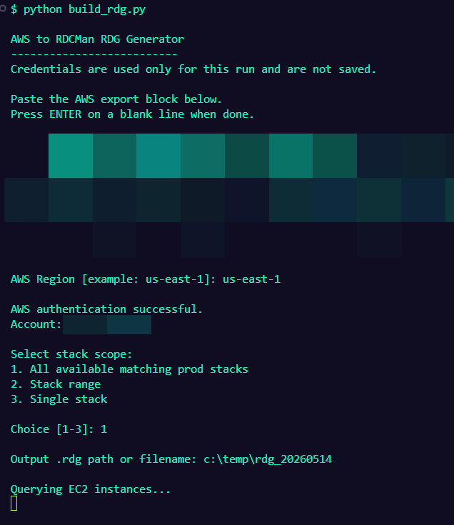
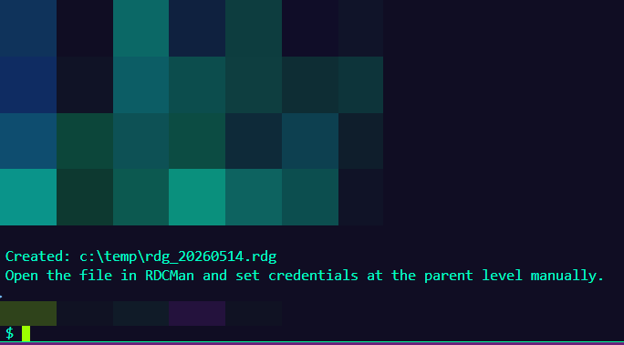
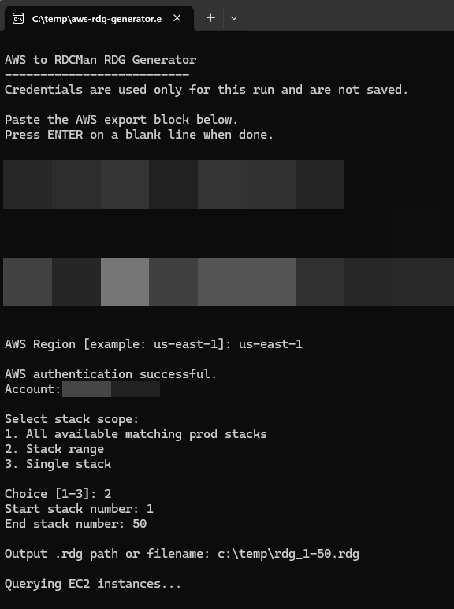
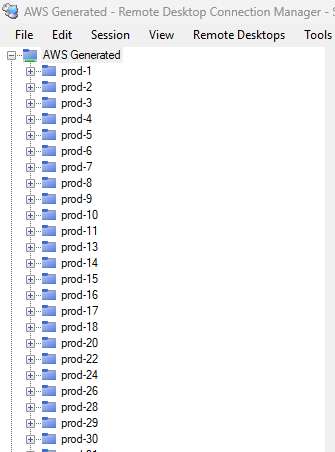

# AWS RDCMan RDG Generator

Python utility for dynamically generating Microsoft RDCMan `.rdg` files from AWS EC2 instance data.

This tool was created to simplify the repetitive process of manually locating public EC2 instance IP addresses across multiple AWS stacks/environments and rebuilding Remote Desktop Connection Manager inventories.

---

# Features

- Queries AWS EC2 instances dynamically
- Generates working RDCMan `.rdg` files automatically
- Supports:
  - All matching stacks
  - Stack ranges
  - Single stack generation
- Supports wildcard instance naming patterns
- Filters only:
  - Running instances
  - Instances with public IP addresses
- Keeps child RDCMan folders collapsed by default for cleaner organization upon opening
- Uses temporary AWS credentials only during runtime
- DOES NOT store any credentials
- DOES NOT make any changes to AWS resources

---

# Screenshots

## Interactive Authentication and Stack Selection



## RDG File Generation



## Example RDCMan Server Inventory



## Generated RDCMan Group Structure



---

# Requirements

## Required Software

- Python 3.10+
- Microsoft Sysinternals Remote Desktop Connection Manager (RDCMan)

This tool generates `.rdg` files specifically for use with RDCMan.

## Python Packages

```bash
pip install boto3
```

## AWS Permissions

```text
sts:GetCallerIdentity
ec2:DescribeInstances
```

---

# Example EC2 Naming Convention

```text
prod-1-webserver
prod-1-processing
prod-1-agswin
prod-1-agswin-0
prod-1-portal
prod-1-portal-0
```

---

# Running the Script

```bash
python build_rdg.py
```

---

# Authentication Workflow

Paste temporary AWS export credentials directly into the prompt.

Example:

```bash
export AWS_ACCESS_KEY_ID="YOUR_ACCESS_KEY"
export AWS_SECRET_ACCESS_KEY="YOUR_SECRET_KEY"
export AWS_SESSION_TOKEN="YOUR_SESSION_TOKEN"
```

Credentials are:
- Used only during runtime
- Never written to disk
- Never embedded into generated `.rdg` files

---

# Stack Scope Options

```text
1. All available matching prod stacks
2. Stack range
3. Single stack
```

---

# RDCMan Behavior

Generated `.rdg` files:
- Organize servers by stack
- Populate public IP addresses automatically into server properties
- Do not contain credentials
- Support parent-level credential inheritance

---

# Security Notes

This tool:
- Does not save AWS credentials
- Does not modify any AWS resources
- Operates read-only against AWS APIs

---

# Executable Validation

PyInstaller was used during development to package and test the script as a standalone Windows executable.

This repository intentionally includes source code only for transparency and easier review.

---

# License

MIT License
